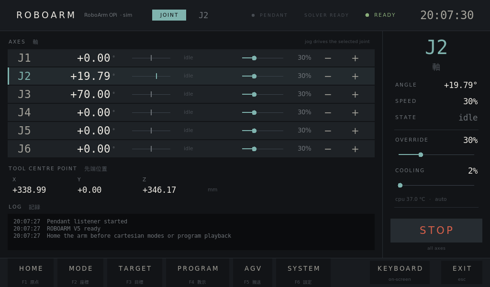
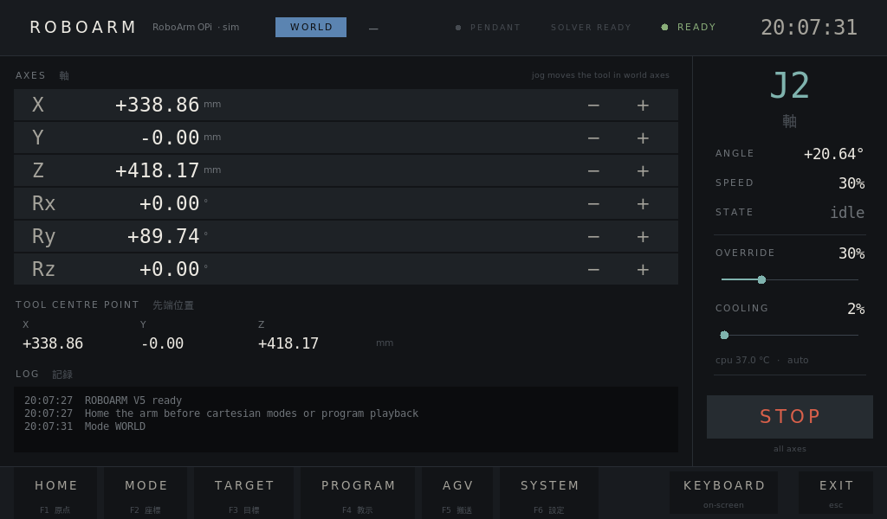
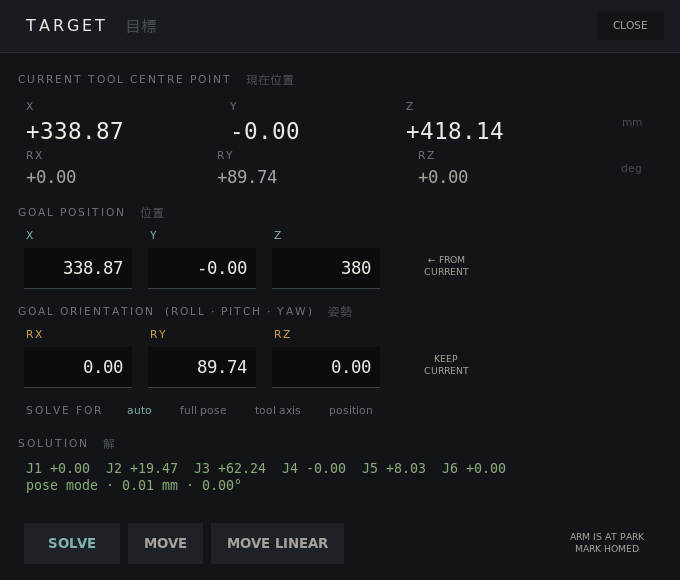
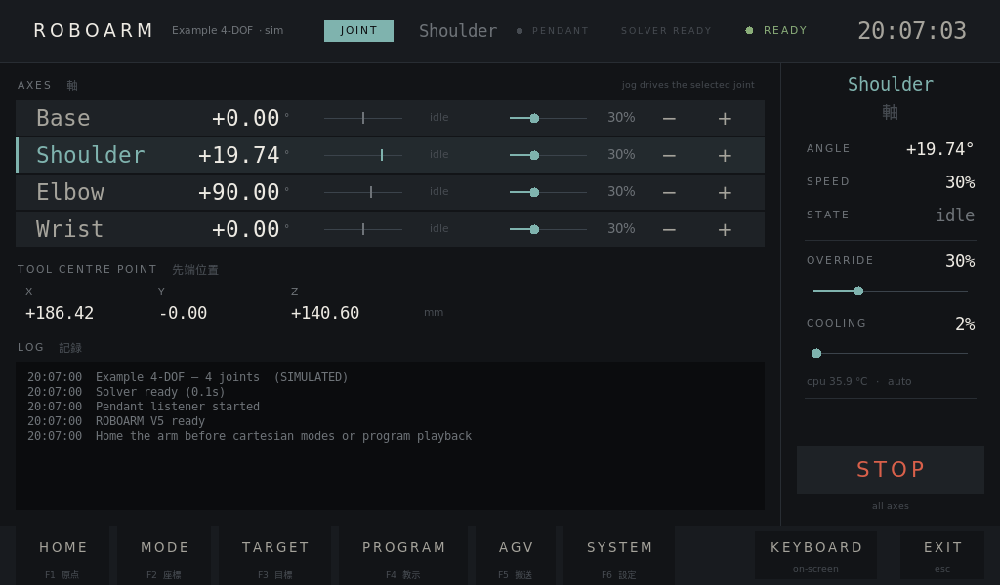

# OPi Robo Controller

A touchscreen controller for homemade robot arms, running on an **Orange Pi Zero 2W**.
It drives the stepper motors directly from the Pi's GPIO pins. It also has a
PS4 controller as a handheld pendant, inverse kinematics, teach-and-replay
programs, homing, an E-STOP, and a link to a wheeled AGV base.

The current version, **V5**, works with any serial arm with 1–7 rotating joints.
The arm's geometry, wiring and limits all live in one robot file.



| World-frame jogging | Inverse-kinematics target | A 4-axis arm, same app |
|---|---|---|
|  |  |  |

## Quick start

On the Orange Pi:

```bash
sudo apt install python3-numpy python3-tk python3-pygame python3-lgpio
cd Scripts
python3 -m roboarm_v5                      # fullscreen HMI; Esc quits
```

On any computer, without the arm (simulated GPIO):

```bash
cd Scripts
python3 -m roboarm_v5 --sim --windowed
python3 -m unittest discover -s tests -v   # 42 tests, no hardware needed
```

To use a different robot, run `python3 -m roboarm_v5 --robot robots/example_4dof.json`.

## Features

- **Any serial arm.** The geometry comes from a DH table or a URDF file
  exported from CAD (Fusion 360, SolidWorks, Onshape). Joint names, joint
  count, pins, gearing and limits all come from the robot file.
- **Inverse kinematics.** A numpy-only Levenberg–Marquardt solver with
  full-pose, tool-axis or position-only modes, chosen to suit the arm. It picks
  the solution closest to the current pose and says why when a target is
  out of reach.
- **Jogging** of single joints, or of the tool in the world frame or its own
  frame. Works from the touchscreen or the PS4 pendant.
- **Straight-line moves** with smooth orientation interpolation.
- **Teach and replay.** Record points, edit them, and play them back
  forwards, in reverse, or one step at a time.
- **Homing.** Each joint seeks its limit switch fast, backs off, then creeps
  back on slowly to set an accurate datum.
- **Exact moves.** Absolute moves send an exact step count
  (`lgpio.tx_pulse`), so a late-waking thread can't cause overshoot.
- **Safety.** A latching E-STOP, limit switches, soft limits, and a clean
  shutdown on SIGTERM.
- **AGV link.** UDP drive packets at 50 Hz to an ESP32 base, with a telemetry readout.
- **Simulator.** `--sim` runs the whole controller against a simulated board,
  including the limit switches.

## Hardware (as wired for this arm)

| | Pins (lgpio numbers, gpiochip 0) |
|---|---|
| J1–J6 step / dir | 226/227, 228/229, 230/231, 232/233, 256/257, 258/259 |
| J1–J6 limit switches | 260–265 (normally closed to ground, internal pull-up) |
| E-STOP loop | 266 (normally closed; a cut wire reads as pressed) |
| Fan (PWM) | 267 |

Link lengths: base to shoulder 136 mm, upper arm 250 mm, elbow offset 26 mm,
forearm 235.25 mm, wrist to flange 11.5 mm, tool 7.5 mm.
See [`Scripts/robots/roboarm_opi.json`](Scripts/robots/roboarm_opi.json).

## Repository layout

```
Scripts/
  roboarm_v5/        V5 controller (package): robot, kinematics, hw, motion, io, ui
  robots/            robot files: this arm (DH + URDF), a 4-axis example
  tests/             unit and simulator tests
  roboarm_V4.py      previous single-file controller (kept for reference)
  roboarm_V3.py, roboarm_V2.py, roboarm_controller.py, motor_control_opi_zero2w.py
                     earlier versions, oldest last
Photos/              the arm and its stepper controller board
docs/screenshots/    V5 screens (1024×600, the 7" panel)
```

## Adding your own arm

Copy `Scripts/robots/roboarm_opi.json`, then fill in a DH table (or point it
at a URDF), the pins and gearing, the joint limits, and which end of travel
each limit switch is at. Try it with `--sim` before running it on the arm.
The full robot-file reference and a step-by-step guide are in
[`Scripts/roboarm_v5/README.md`](Scripts/roboarm_v5/README.md).

## Status

V5 is tested in the simulator only. Before it drives the real arm, work
through the **bench checks** in
[`Scripts/roboarm_v5/README.md`](Scripts/roboarm_v5/README.md). They cover
motor directions, which end of travel each switch is at, the L3 elbow offset
and the J4 axis, and the accuracy of exact-count moves.

V4 still runs as before (`python3 Scripts/roboarm_V4.py`). V5's README lists
the kinematics bugs in V4 that V5 fixes.
